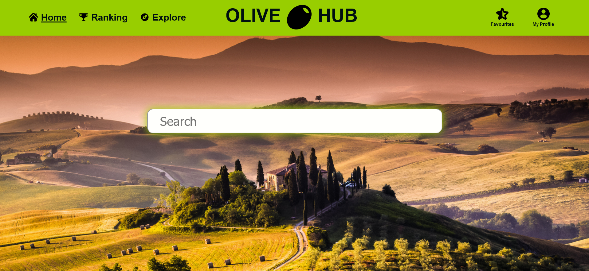
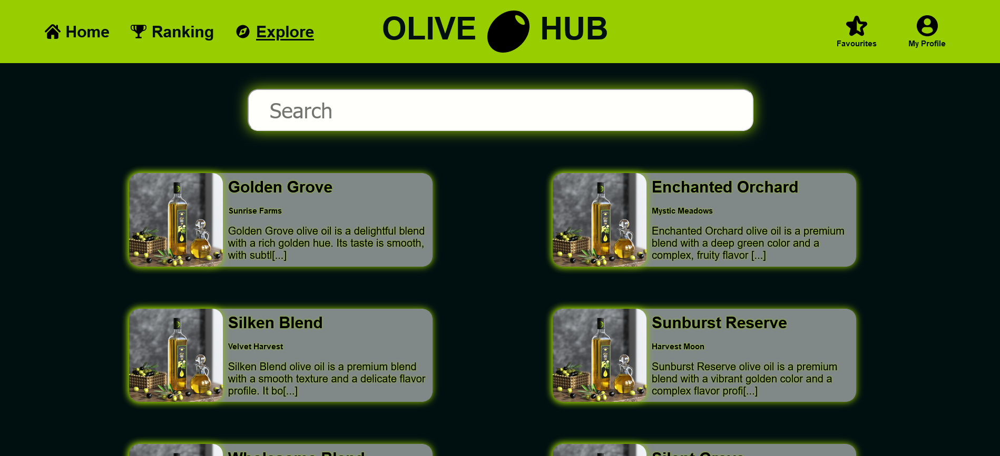

<br />
<div align="center">
  <a href="https://github.com/ptrmad/OliveHub">
    
  </a>
</div>

<h3 align="center">OliveHub - Discover, Learn, and Enjoy the World of Olive Oil</h3>

<p align="center">
  A React-based webpage designed to for olive oil enthusiasts.
</p>

## About The Project

OliveHub is a comprehensive webpage designed for anyone who loves olive oil!

<div align="center">
  
</div>

### Built With

- **React (v19 beta):** A JavaScript library for building user interfaces.
- **React Features:**
  - State Management
  - Context API
  - Hooks (including the `use` feature from React 19 beta)
- **React Router DOM:** A library for handling routing in React applications.
- **CSS Modules:** A technique for managing CSS styles within React components.
- **Vite:** A lightning-fast development server and bundler.

<p align="right">(<a href="#readme-top">back to top</a>)</p>

## Getting Started

This section guides you through setting up OliveHub for local development.

### Prerequisites

You'll need Node.js and npm (Node Package Manager) installed on your system. You can download and install them from the official Node.js website (https://nodejs.org/en).

**Optional:**

- A code editor or IDE of your choice (e.g., Visual Studio Code, WebStorm) for a more streamlined development experience.

### Installation

1. Clone the Repository

   ```bash
   git clone https://github.com/ptrmad/OliveHub.git   
   

   ````
2. Install react
   ```sh
   npm install react@beta react-dom@beta
   ```

### Developer Server

1. Navigate to the project directory

   ```sh
   cd  OliveHub
   ```

   2. Run developer server

   ```sh
   npm run dev
   ```

This will start the development server and open OliveHub in your web browser, typically at http://localhost:5173/.

<p align="right">(<a href="#readme-top">back to top</a>)</p>

## Usage

OliveHub is designed to help users find and read reviews of the best olive oils. Here are some examples of how you can use OliveHub:

### Example 1: Searching for Olive Oils

Use the search bar at the top of the homepage to find specific olive oils. Simply type in the name or the brand of the olive oil you are looking for, and OliveHub will display matching results. You can also go to /explore - there you'll find reused

```jsx
<SearchBar />
```

component and all the olive oils in database. Searchbar is working based on the react context mechanism.

  

### Example 2: Adding Olive Oils to Favourites

Users can easily add their preferred olive oils to their favourites list. This feature allows users to quickly access their favourite olive oils for future reference. User can easily access their favourite olive oils by going to the separate /favourites subpage, and there manage their list. User can add item to favourites from the view of single olive oil review and it's done with help of context mechanism.

```jsx
<Favourites />
```

### Example 3: Viewing Rankings

OliveHub provides a ranking of the best olive oils based on user ratings. You can view the top-rated olive oils and see their details.

```jsx
<Ranking />
```

## Future

I have exciting plans to enhance OliveHub with new features and improvements. Here are some of the key updates I aim to implement:

### Responsive Web Design

In the near future, I plan to make OliveHub fully responsive, ensuring a seamless and enjoyable browsing experience on desktops, tablets, and mobile devices. This includes:

- **Adaptive Layouts:** Redesigning our layout to adapt to different screen sizes.
- **Mobile-Friendly Navigation:** Enhancing navigation for easy use on smaller screens.
- **Optimized Images and Content:** Ensuring images and content are properly scaled and optimized for various devices.

### Form for Adding New Items

To expand database of olive oils, I plan to introduce a feature that allows users to submit new items. This feature will include:

- **User-Friendly Submission Form:** A simple and intuitive form for users to add new olive oils to our database.

